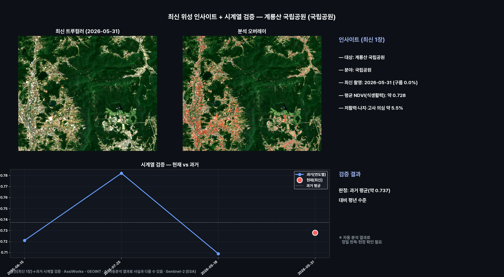
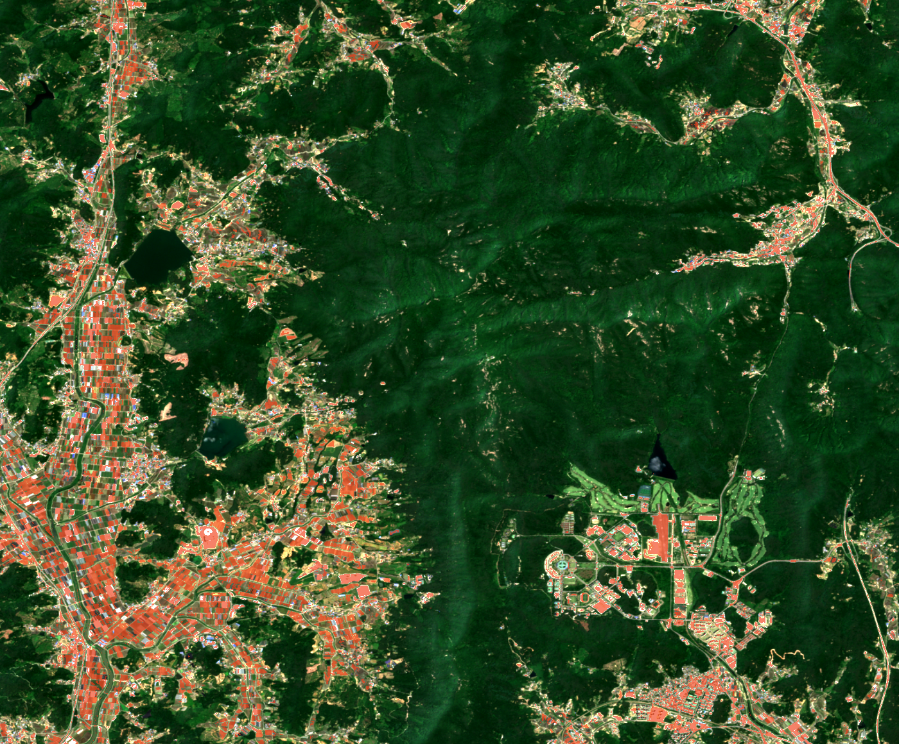
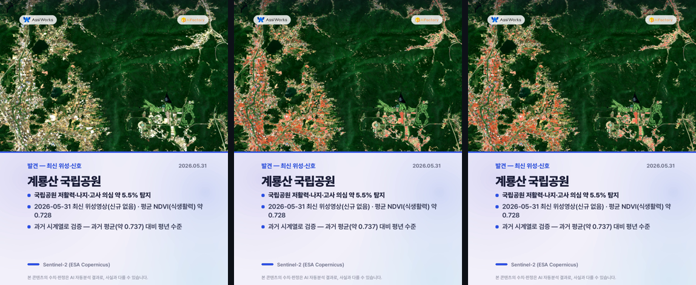
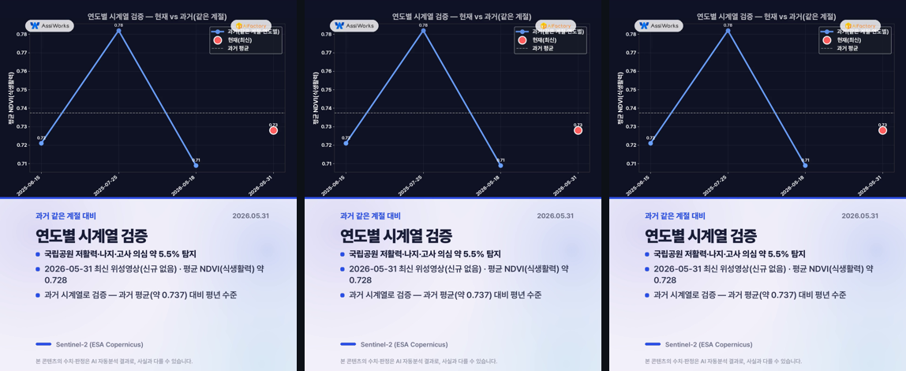
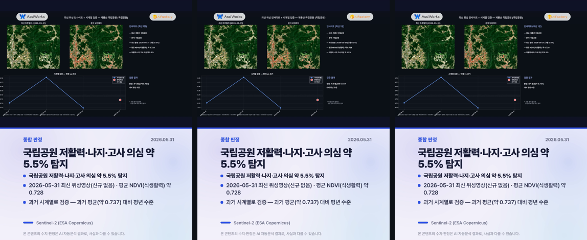

# 최신 위성 인사이트 — 계룡산 국립공원 (국립공원)

**발행**: 2026-06-15 10시 · **분야**: 국립공원 · **센서**: Sentinel-2 L2A (ESA) · 10 m
**원본 촬영**: 2026-05-31 (구름 0.0%, 최신 위성영상(신규 장면 없어 최신 영상 사용))

> ⚠️ **추정치 안내**: 본 콘텐츠의 모든 수치·판정·해석은 AI·알고리즘이 위성영상을 자동 분석한 **추정 결과**로, 사실과 다를 수 있습니다. 공식 통계·현장 확인과 차이가 있을 수 있으므로 참고용으로만 활용하시기 바랍니다.

---

## 핵심 발견
> **국립공원 저활력·나지·고사 의심 약 5.5% 탐지**

## 1단계 — 발견 (최신 1장)
- 2026-05-31 촬영 영상에서 국립공원 신호 분석.
- 평균 NDVI(식생활력): 약 0.728.
- 식생활력 평균 약 0.728 · 저활력 약 5.5%
- 나지·산사태 흔적·고사목 의심 구간 점검 (정밀 판독은 고해상 필요)

## 2단계 — 시계열 검증
동일 지역 과거 청천 영상(3개)과 비교해 검증합니다.
- 과거: 06-15 0.721, 07-25 0.782, 05-18 0.709
- 현재: 05-31 약 0.728
- **판정: 과거 평균(약 0.737) 대비 평년 수준**
- ※ 자동 분석 결과로 정밀 판독·현장 확인이 필요합니다. (산사태·불법건축물·해변쓰레기·고사목 등 미세 대상은 고해상 영상 병행 권장)

## 분석 종합 (발견 + 검증)

## 분석 오버레이

## 영상카드 (미리보기)

_아래는 각 영상의 대표 장면입니다. 영상은 링크에서 재생/다운로드._

▶️ [card1_discovery.mp4 영상 보기](videocards/card1_discovery.mp4)

▶️ [card2_timeseries.mp4 영상 보기](videocards/card2_timeseries.mp4)

▶️ [card3_summary.mp4 영상 보기](videocards/card3_summary.mp4)

---
_AssiWorks - GEOINT · 2026-06-15 10시 · Sentinel-2 (ESA)_
